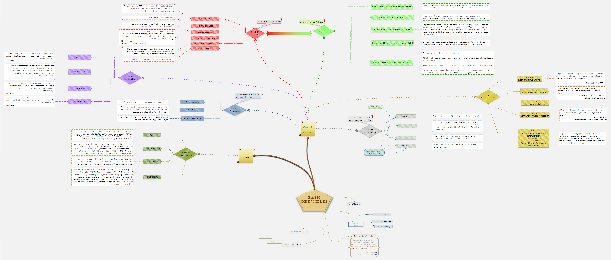

# Programming puzzle pieces

This is an on-going personal project without the guarantee to contain everything it should tending to collect the general 'should-know' puzzle pieces in programming but without diving into different languages, frameworks, libraries and technologies (for now).

## Disclaimer
:world_map: This is a simplified visual representation. The scope is to remain simple and to cover a large variety of different terms used in programming in the same time. Explaining the different concepts and providing examples for them is outside of the scope for now. My advice is to do your own research by yourself if you are interested in a specific topic and use this project as a collection of the "existing things" for your studies.

:recycle: If you want you can use freely the entire image and / or the attached visio files or just a portion of it and modify it without any limitation and without mentioning me or the github page (it is your decision).

:pushpin: If you are interested in other similar projects, please check [this web developer roadmap on github](https://github.com/kamranahmedse/developer-roadmap).

## Backlog

Just a set of ideas I conider to extend or invent a main topic for them in the future.

[[ Click here to open the image in FULL SCREEN ]](https://raw.githubusercontent.com/CyberDani/personal-roadmap/master/ProgrammingRoadMap.png)

### [[[ Click here ]]](https://github.com/CyberDani/Programming-puzzle-pieces/wiki/Online-resources)

Programming principles are simple ideas proposed as advices in order to help to keep your code clear and maintainable. It is also a common programming mentality, a way of thinking when you have to deal with a more complex project.

[[ Click here to open the image in FULL SCREEN ]](https://raw.githubusercontent.com/CyberDani/personal-roadmap/master/Principles.png)

A design pattern is "a generalized solution to a commonly occuring problem". Three important aspects needs to be taken into consideration: 
1. **Problem:** _has aspect of design regarding to a specific optimization or to a non-functional requirement (also known as QoS - quality of System)_
2. **Solution:** _the pattern itself having a specific structure and roles_
3. **Consequances:** _since a pattern optimizes some aspects over others, it is importand to understand the negative and positive aspects as well._

Also a design pattern is meant to follow the SOLID principles and by this it can offer a comfortable solution.

### [[[ Click here ]]](https://github.com/CyberDani/Programming-puzzle-pieces/wiki/Design-Patters)

### Latest changes

- [x] Detaching online learning links from the backlog, added freely accessible books (2019.09.26)
- [x] Detaching practice links from the backlog (2019.09.25)
- [x] Added Antipatterns to design patterns, finish it as part1 because it looks busy to extend in the future (2019.09.21)
- [x] Added RAII to Principles (2019.09.14)
- [x] Redesign Design Patterns, increase font size for better readability (2019.09.10)
- [x] Detaching principles from the main image (2019.08.25)
- [x] Design fixes were made on design patterns (2019.07.22)
- [x] Added new design patterns: Distribution patterns, Safety and Reliability patterns (2019.07.21)
- [x] Added resource design patterns, minor design fixes were made (2019.07.18)

### How can I contribute?
If you observe any missing important elements which are part of programming generally speaking (not specific to a language, framework or library) or find any kind of inacurracy or mistake please feel free to open a new issue and try to motivate your reason. Every observation and suggestion is welcomed and I will try to react to all of them. You actively improve the quality of the project by this and also offer a cleaner quality of information for the other visitors. Thank you for helping :+1:

### Why do I do this?
0. Most of the knowledge I have acquired in computer science I learned from internet and books, from great professionals motivated in teaching things as well as they can. This project is still too few to give something back from it, but if you find this interesting in any way, you can use these pictures, Visio files and information how you want.
1. It is quite frustrating that I hardly always have to find out that there is a basic notion, principle, methodology or a should know thing that I does not know. Thank you my computer science university :kissing_heart:. As a result I took a decision to learn by myself and figure out basic things as a starting point to see the building blocks. I want this project to serve as a remainder for the building blocks.
2. In developer communities sometimes I find hard to understand someone at a concept level at least just because I am not familiar with a word for example. So every time I see a notion, principle, methodology, pattern, book, anything important I write it down, learn it later and see if I can include in this project.
3. This project is also an experiment about how a general "should-know" roadmap would look like that I will definetely consider giving to the past version of me.
