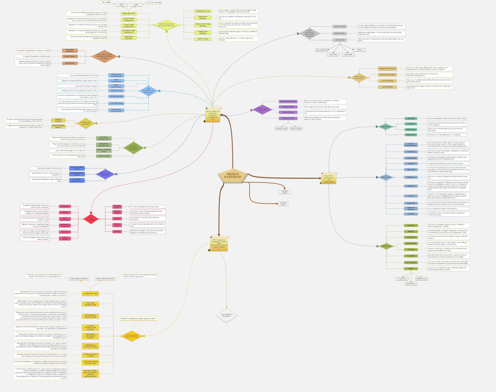

# Personal roadmap

This is an on-going personal project without the intent to contain everything or to train the greatest programers with it. If you are interested in projects like this, please check [this github page](https://github.com/kamranahmedse/developer-roadmap). I try to update this project frequently so updates and design fixes will be coming if you look back. If you want you can use freely the entire image or just a part from it how you want without mentioning me or the github page (it is your decision).

### Disclaimer
This project tends to collect the general 'should-know' puzzle pieces in programming without diving into frameworks, libraries and technologies. This is a simplified visual representation. The scope is to remain simple and to cover a large variety of different elements used in programming in the same time. Explaining the different concepts the project contains is outside of the scope for now. As a friendly advice you should do your research by yourself if you are interested in a specific topic. I recommend this roadmap to autoeducative developers who are curious about the different directions and concepts in this profession. It can also offer an opportunity to test yourself about how much you already know as well as defining the next topics might want to study.

[[ Click here to open the image by its URL ]](https://raw.githubusercontent.com/CyberDani/personal-roadmap/master/ProgrammingRoadMap.png)

## Design patterns

A design pattern is "a generalized solution to a commonly occuring problem". Three important aspects needs to be taken into consideration: 
1. **Problem:** _has aspect of design regarding to a specific optimization or to a non-functional requirement (also known as QoS - quality of System)_
2. **Solution:** _the pattern itself having a specific structure and roles_
3. **Consequances:** _since a pattern optimizes some aspects over others, it is importand to understand the negative and positive aspeects as well._

Also a design pattern is meant to follow the SOLID principles and by this it can offer a comfortable solution.

[[ Click here to open the full image by its URL ]](https://raw.githubusercontent.com/CyberDani/personal-roadmap/master/DesignPatterns.png)

### Latest changes

- [x] minor fixings (2019.06.17)
- [x] Extending references for online practicing (2019.06.02)
- [x] Design fixes were made on design patterns (2019.05.29)
- [x] Design fixes were made on design patterns (2019.04.27)
- [x] Design fixes were made on design patterns (2019.04.23)
- [x] Design fixes were made on design patterns (2019.04.22)

### How can I contribute?
If you observe any missing important elements which are part of programming generally speaking (not specific to a language, framework or library) please feel free to open a new issue and do not forget to motivate your reason. Thank you for helping :+1:

### Why do I do this?
0. Most of the knowledge I have acquired in computer science I learned from the internet. Currently I am learning day by day from awesome websites. It is still too few to give something back from it, but if you find this interesting in any way, use this picture and information how you want.
1. It is quite frustrating when I try to learn or understand something I hardly always have to find out that there is a basic notion, principle, methodology or a should know thing that I does not know. Thank you my computer science university :kissing_heart:. As a result I took a decision to learn by myself and figure out basic things as a starting point to see the building blocks. This image maybe will serve as a remainder for the building blocks I am collecting now.
2. In developer communities sometimes it can be hard to understand everyone at a concept level at least just because I am not familiar with a word for example. So every time I see a notion, principle, methodology, pattern, book, anything important I write it down, learn it later and see if I can include in the image.
3. I asked myself few time how a general "should-know" roadmap would look like for the past version of me and I realized that it is not an easy story. Based on that question this project might be an interesting experiment.
