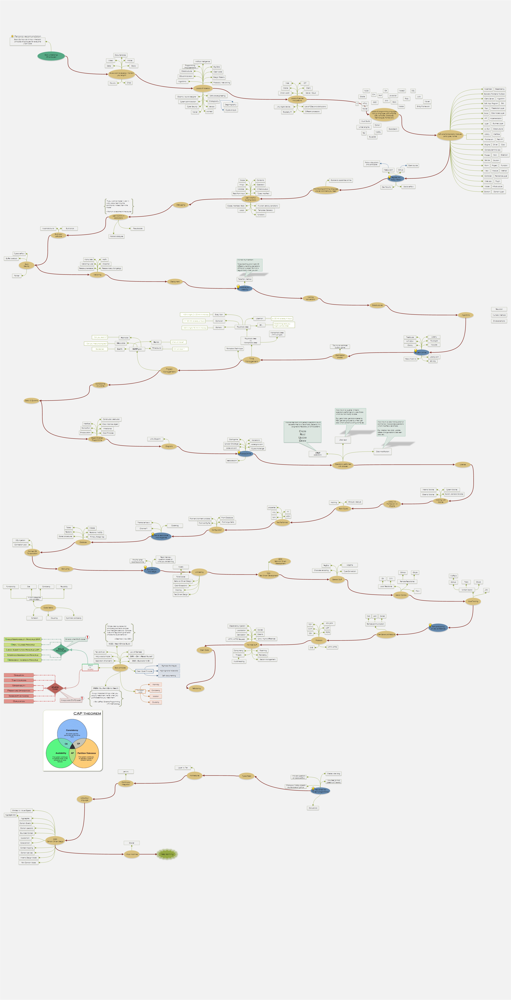

# Personal roadmap

It is a personal collection without the intent to contain everything or to recruit the greatest programers with that. If you are interested in professional and already finished roadmaps, please check [this github page](https://github.com/kamranahmedse/developer-roadmap). I plan to update this little project frequently so updates and design fixes will be coming if you look back. If you like it, you can use freely the entire image or just a part from it how you want without mentioning me or the github page (it is your decision).

### Important
This project tend to collects the general 'should-know' pieces in programming without diving into frameworks, libraries or technologies. I recommend this roadmap for autoeducative beginners who are curious about the different directions in this profession or just simply want to test herself/himself about what she/he knows or should learn next. Always try to figure out first if the new thing you plan to learn will help you and what are its potentials. PLEASE DO NOT follow the same direction you see on the image and skip the parts you do not need! 

[[ Click here to open the image by its URL ]](https://raw.githubusercontent.com/CyberDani/personal-roadmap/master/ProgrammingRoadMap.png)

### Latest changes

- [x] Extending the picture (will be more fixes to prittify)
- [x] Extending: Software names, issue tracking, avanced stuff
- [x] Adding: Basic Security
- [x] Added main topics: TDD(added BDD as an extension), DDD, time and project management
- [x] Extending design pattern with CQR, CQRS

See the created and reported issues on waffle board:

### How can I contribute?
If you observe any missing important elements which are part of programming generally speaking (not specific to a language, framework or library) please feel free to open a new issue and do not forget to motivate your reason. Thank you for helping :+1:

### Why do I do this?
0. Most of the knowledge I have acquired in computer science I learned from the internet. Currently I am learning day by day from awesome websites. It is still too few to give something back from it, but if you find this interesting in any way, use this picture and information how you want.
1. It is quite frustrating when I try to learn or understand something I hardly always have to find out that there is a basic notion, principle, methodology or a should know thing that I does not know. Thank you my computer science university :kissing_heart:. As a result I took a decision to learn by myself and figure out basic things as a starting point to see the building blocks. This image maybe will serve as a remainder for the building blocks I am collecting now.
2. In developer communities sometimes it can be hard to understand everyone at a concept level at least just because I am not familiar with a word for example. So every time I see a notion, principle, methodology, pattern, book, anything important I write it down, learn it later and see if I can include in the image.
3. I asked myself few time how a general "should-know" roadmap would look like for the past version of me and I realized that it is not an easy story. Based on that question this project might be an interesting experiment.
